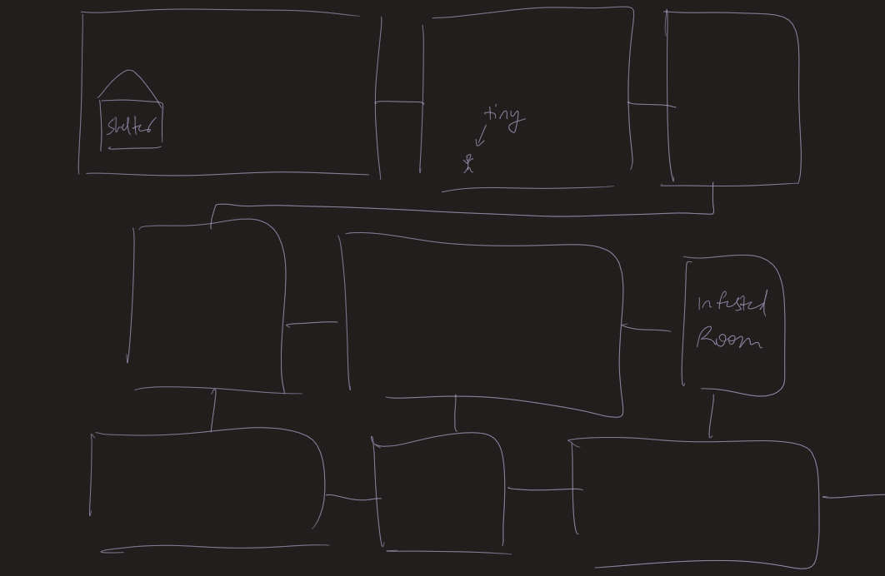
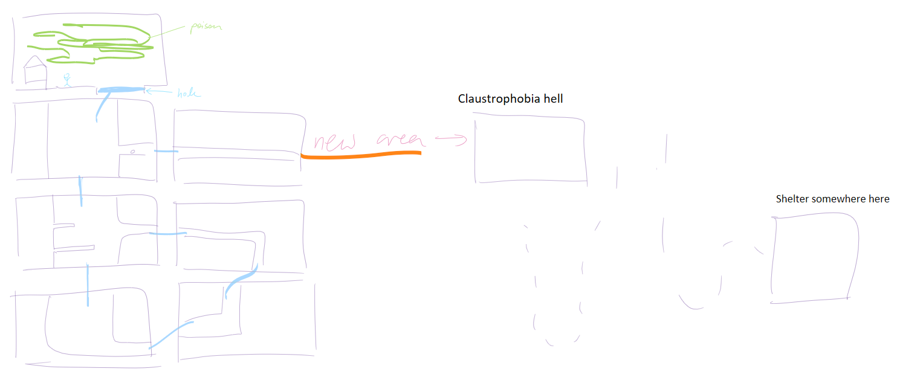
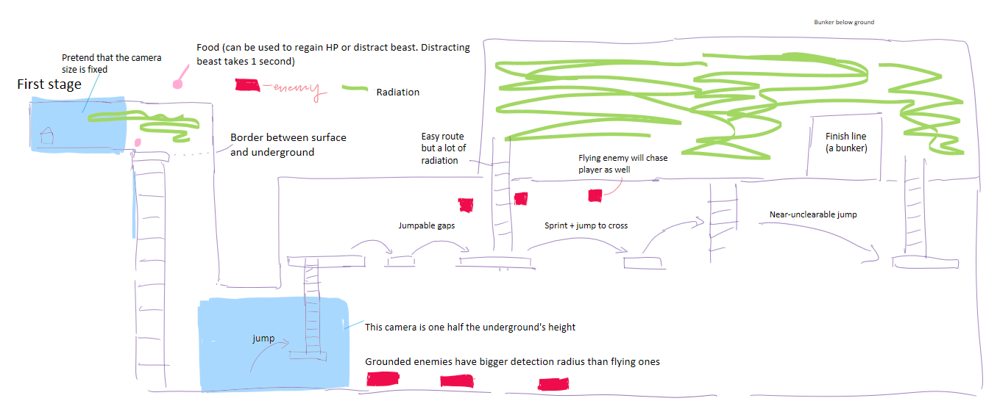
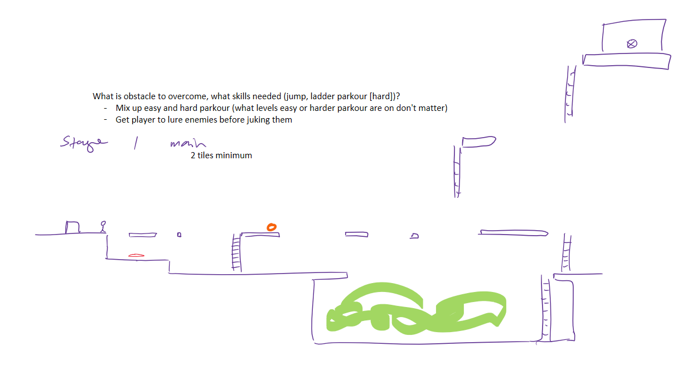
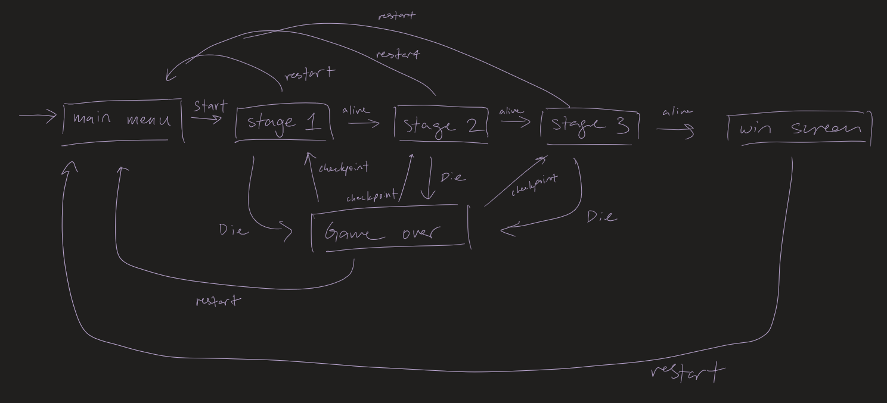

# After Woods #

## Summary ##

After Woods is a 2D side-view platformer focused around exploration and survival. Set in a post-apocalyptic wasteland, After Woods follows the journey of an adventurer trying to find their way home. While on a routine supply run by traveling through the underground caverns, the adventurer feels like they are being watched. Suddenly, they hear footsteps approaching them at an alarming rate, belonging to a mysterious, threatening beast. Panicking, they run as fast as they can away from the beast and after a long chase, finally evades it by escaping to the surface. But the adventurer cannot stay there because soon, the radiation poisoning will overtake them. Even worse, looking around, they realizes that they have never seen this place before. Can you guide the adventurer home, avoiding the beast, mutated creatures, and death from radiation?

## Project Resources

[Web-playable version of your game.](https://itch.io/)  
[Trailor](https://youtube.com)  
[Press Kit](https://dopresskit.com/)  
[Proposal: make your own copy of the linked doc.](https://docs.google.com/document/d/1qwWCpMwKJGOLQ-rRJt8G8zisCa2XHFhv6zSWars0eWM/edit?usp=sharing)  

## Gameplay Explanation ##

**In this section, explain how the game should be played. Treat this as a manual within a game. Explaining the button mappings and the most optimal gameplay strategy is encouraged.**

<!-- **Add it here if you did work that should be factored into your grade but does not fit easily into the proscribed roles! Please include links to resources and descriptions of game-related material that does not fit into roles here.**
(stage design, insert stage prototypes and drawings) -->
**Stage design - Kris**

Initial stage designs were much more grid like, and the camera was to jumpcut to each room upon the player entering them:

This was eventually changed such that each stage was relatively smaller and that the camera was to follow the player, with the camera small enough to hide most of the stage:

The stages were then made shorter and smaller to emphasize the beast timer's countdown, in that the beast is never far from the player:

# Main Roles #

Your goal is to relate the work of your role and sub-role in terms of the content of the course. Please look at the role sections below for specific instructions for each role.

Below is a template for you to highlight items of your work. These provide the evidence needed for your work to be evaluated. Try to have at least four such descriptions. They will be assessed on the quality of the underlying system and how they are linked to course content. 

*Short Description* - Long description of your work item that includes how it is relevant to topics discussed in class. [link to evidence in your repository](https://github.com/dr-jam/ECS189L/edit/project-description/ProjectDocumentTemplate.md)

Here is an example:  
*Procedural Terrain* - The game's background consists of procedurally generated terrain produced with Perlin noise. The game can modify this terrain at run-time via a call to its script methods. The intent is to allow the player to modify the terrain. This system is based on the component design pattern and the procedural content generation portions of the course. [The PCG terrain generation script](https://github.com/dr-jam/CameraControlExercise/blob/513b927e87fc686fe627bf7d4ff6ff841cf34e9f/Obscura/Assets/Scripts/TerrainGenerator.cs#L6).

You should replay any **bold text** with your relevant information. Liberally use the template when necessary and appropriate.

## Producer

**Describe the steps you took in your role as producer. Typical items include group scheduling mechanisms, links to meeting notes, descriptions of team logistics problems with their resolution, project organization tools (e.g., timelines, dependency/task tracking, Gantt charts, etc.), and repository management methodology.**

## User Interface and Input - Esther Cheng

When designing the user interface, I wanted to follow a design pattern where the UI design aesthetic is simple, clean, and intuitive. The aim is to make all crucial information readily available to the player without overwhelming any of the screens. The UI is designed to be clear and readable, ensuring that important information is accessible but does not disrupt the player's immersion throughout the game.

`Pause/Main/Game Over Menu` - I implemented the logic for the main menu, game over menu, and pause menu. These screens provide players with options to pause, exit or enter the game without disrupting the flow of the game. There's also the option to view the tutorial page of the game. The UI elements, including the menus and the fonts, were later improved upon by other group members.

[Code for the pause menu implementation](https://github.com/SerpentSnek/After-Woods/blob/main/After%20Woods/Assets/Scripts/UI/PauseMenuController.cs).

[Code for the main menu implementation](https://github.com/SerpentSnek/After-Woods/blob/main/After%20Woods/Assets/Scripts/UI/MainMenuController.cs).

[Code for the game over menu implementation](https://github.com/SerpentSnek/After-Woods/blob/main/After%20Woods/Assets/Scripts/UI/GameOverController.cs).

`Health/Radiation Bars` - I implemented the logic for both the health and radiation bar, which incorporated the slider component to adjust the values of the bar and also allowed changes to the color of the values depending on how low or high they were. The UI elements I made were later improved upon by other memebers who wanted to incorporate their own improvements or game mechanics for their own usage. [Code for the implementation](https://github.com/SerpentSnek/After-Woods/blob/main/After%20Woods/Assets/Scripts/UI/HealthBarController.cs).

`Player Stat Display` - On the game over screen, I implemented a UI panel that shows the player's stats. This includes the run time of the game, the player's remaining health, radiation percentage, and food remaining. This information is critical for players so they are able to strategize their growth and make decisions on resource allocation and skill upgrades during their next playthrough.

One of the great benefits that came with the UI designs was how modular they were. This modularity made it possible to easily scale the UI, adapt it to new requirements, and integrate new features without disrupting the overall design.

**Add an entry for each platform or input style your project supports.**

## Movement/Physics

The movement system of the main character is quite similar to other popular 2D games. The player is able to move left and right, press space to jump, and press up to climb ladders. At the same time, the player can choose to jump higher if the player keeps holding the space instead of releasing it right after pressing it. The player can also sprint. 

We use A* pathfinding to implement our enemies' ai. As the picture shows, all enemies are given a path to the player by A*. After the player enters their chase range, they will chase the player according to the path. Otherwise, they will patrol in a certain area. To avoid flying enemies falling to the ground, we set its gravity to 0. One of the key points of our game is our beast ai. The beast cannot fly, so it will jump to platforms according to the height of the player. However, there are some problems with A* pathfinding. It cannot set the best path for the beast to chase the player. Sometimes it will stuck because its collider is too big. Other enemies are small enough so this problem won't happen to them. We set a check condition so everytime if a beast get stuck in an area for a while, it will try to jump out of there.

## Animation and Visuals

### Assets

[Cave Background Assets](https://slashdashgamesstudio.itch.io/cave-background-assets) from SlashDashGamesStudio licensed under [Creative Commons Attribution v4.0 International](https://creativecommons.org/licenses/by/4.0/deed.en)

*All other assets made by me.

### Visual Style

In developing our game, we aimed to incorporate two distinct themes: the surface and the subsurface. The surface is depicted as a desolate wasteland, scarred by the aftermath of radiation. In contrast, the subsurface offers a refuge from the radiation but is fraught with dangers, as monsters hide within its depths. The game adopts a 2D pixel art aesthetic, ideal for platform gameplay. I created all the sprites and assets, with the exception being the background for the underground scenes.

### Animation System

For the animation process in our game, I utilized Aseprite, a program that also served as my workspace for designing all the sprites and assets for After Woods. Aseprite allows me to create individual frames and hand-draw each animation for our animated sprites. Once an animation sequence for a sprite is complete, I export the entire character as a sprite sheet, which compiles all necessary frames for the character's animation.

This sprite sheet is then imported into Unity, where I can dissect the frames using the sprite editor. Using Unity's Animation tab, I create the animations for each character or entity. For instance, the player character has eight animations, all of which are observable during gameplay.

The Animator is then used to connect the animations together. Below is an image of the player state. The transition works by connecting to the PlayerMovementv2 script. If the “Player_Idle” state detects that the xSpeed in the script is higher than 0, then it will transition to the “Player_Walk” state. The “Player_Walk” state will transition into the “Player_Run” state if the player presses the shift button to run. The state will check for an xSpeed above 13 which means the character is at running speed. There are other states that trigger from the movement and controller script.

### Parallax

The background of the above ground and underground use parallax to create an effect where different layers move at different speeds, simulating depth as the player traverses the level. There are three scripts that work together: `ParallaxCamera.cs`, `ParallaxBackground.cs`, and `ParallaxLayer.cs`. The depth of the layers are controlled in the ParallaxLayer script by a variable called parallaxFactor which is the rate at which the layer moves in response to camera movement along the x-axis. A smaller number means the layer moves slower, adding to the depth effect. When the camera moves, ParallaxCamera calculates the movement delta and notifies ParallaxBackground via the onCameraTranslate event. ParallaxBackground then tells each ParallaxLayer to move accordingly.

## Game Logic

<!-- **Document the game states and game data you managed and the design patterns you used to complete your task.** -->
#### Beast's timer
The timer used to countdown the beast's chase is implemented through `Timer.cs`, which the game manager [has a reference of](https://github.com/SerpentSnek/After-Woods/blob/45cd8e60a24c00b6933d1f58ee9353f390c159cb/After%20Woods/Assets/Scripts/Game/GameManager.cs#L86). The game manager will use this reference to reset the timer after every stage completion or stage restart.

#### Game manager
Game logic was handled through a game manager singleton in `GameManager.cs`. The game manager is responsible for handling scene changes, saving player data across the stages, and tracking the player's run time. All menu controllers (`MainMenuController.cs`, `WinController.cs`, `GameOverController.cs`) use `GameManager.Instance` to access player stats and call for scene changes. There were a total of 6 states to be managed, as seen in the state diagram below.

When first starting the game, the player game object is spawned [as a child object to the game manager](https://github.com/SerpentSnek/After-Woods/blob/45cd8e60a24c00b6933d1f58ee9353f390c159cb/After%20Woods/Assets/Scripts/Game/GameManager.cs#L84) as to more easily bring the player across levels.

#### Scene and level management
The current stage is tracked by the variable [currentStage, which is set to stage 1 upon starting the game from the title screen](https://github.com/SerpentSnek/After-Woods/blob/01c7fa5162763dd472516aa37e824d419dc681c7/After%20Woods/Assets/Scripts/Game/GameManager.cs#L72). The following methods deal with scene transition:
- Upon completing a level, `currentStage` is incremented in [LoadNextStage()](https://github.com/SerpentSnek/After-Woods/blob/01c7fa5162763dd472516aa37e824d419dc681c7/After%20Woods/Assets/Scripts/Game/GameManager.cs#L170). Since player position is reset to the origin every stage, a [coroutine](https://github.com/SerpentSnek/After-Woods/blob/01c7fa5162763dd472516aa37e824d419dc681c7/After%20Woods/Assets/Scripts/Game/GameManager.cs#L175) is used to load the next level so that players cannot see themselves teleporting to the origin before the next stage is fully loaded.
- [LoadGameOver()](https://github.com/SerpentSnek/After-Woods/blob/45cd8e60a24c00b6933d1f58ee9353f390c159cb/After%20Woods/Assets/Scripts/Game/GameManager.cs#L135) pauses the runtime timer and invokes `DontDestroyOnLoad(gameObject)` in case players wish to restart from a checkpoint. The game over screen is called by `PlayerLogicController.cs` upon death.
- [LoadMainMenu()](https://github.com/SerpentSnek/After-Woods/blob/45cd8e60a24c00b6933d1f58ee9353f390c159cb/After%20Woods/Assets/Scripts/Game/GameManager.cs#L107) loads the title screen and resets player stats and all timers and load in te first level.
- Like `LoadMainMenu()`, [`LoadStartStage()`](https://github.com/SerpentSnek/After-Woods/blob/45cd8e60a24c00b6933d1f58ee9353f390c159cb/After%20Woods/Assets/Scripts/Game/GameManager.cs#L117) resets the beast's timer but will also start the runtime timer.
- [LoadCurrentStage()](https://github.com/SerpentSnek/After-Woods/blob/01c7fa5162763dd472516aa37e824d419dc681c7/After%20Woods/Assets/Scripts/Game/GameManager.cs#L148) will load in the last saved player stats and reset player position back to the start of the stage the player died in.

#### Player logic
Information that needed to persist across stages was player data, stored under the [variable `checkpointInfo`, a `PlayerData` class within the game manager](https://github.com/SerpentSnek/After-Woods/blob/01c7fa5162763dd472516aa37e824d419dc681c7/After%20Woods/Assets/Scripts/Game/GameManager.cs#L16). Specifically, this class remembers how much HP, food, and radiation damage the player has at the start of each level. Restarting the stage the player died in with [LoadCurrentStage()](https://github.com/SerpentSnek/After-Woods/blob/01c7fa5162763dd472516aa37e824d419dc681c7/After%20Woods/Assets/Scripts/Game/GameManager.cs#L148) means reassigning the stats within the player's `PlayerLogicController.cs` with checkpoint data, while progressing to the next stage means [reassigning the checkpoint fields](https://github.com/SerpentSnek/After-Woods/blob/45cd8e60a24c00b6933d1f58ee9353f390c159cb/After%20Woods/Assets/Scripts/Game/GameManager.cs#L165). The point of checkpoints was to reduce frustration from repeated deaths we expected from new players.

**`PlayerLogicController.cs`** holds the logic for different kinds of collisions i.e. what happens when running into ladders, radiation, food, and the beast. The controller is attached to the player game object that is referenced by the game manager.

# Sub-Roles

## Audio - Esther Cheng

### Background Music

For the soundtrack of the game, since I don't have much experience with making my own music and don't have the creativity to do so, I relied on finding copyright free songs on YouTube. When trying to figure out what the general direction for music was for the game, I asked for feedback from my group members and we decided on a more atmospheric, melachnoic vibe of the game. The main inspiration for the soundtrack was the soundtrack for `Rain World` as it fit perfectly with the type of survival game we were going for. 

**Main Menu**

[`Lost Memories by Ghostrifter`](https://youtu.be/GTxsbUzHgcA?si=vsM2N83MzWeuuMj7) is the song I chose for the main menu because the track not only fits the lo-fi, electronic sound we were looking for but it has the right amount of excitement and tenseness to keep the player on the edge of their seat when they're waiting to start the game.

**Overall Game**

The following tracks were picked to play over each of the stages:

[`Solitude by Ghostrifter`](http://bit.ly/ghostrifter-yt)

Creative Commons — Attribution-NoDerivs 3.0 Unported — CC BY-ND 3.0

Free Download: https://hypeddit.com/hbqndr

[`Neon Drive by Ghostrifter`](http://bit.ly/ghostrifter-yt)

Creative Commons — Attribution-NoDerivs 3.0 Unported — CC BY-ND 3.0

Free Download: https://hypeddit.com/pto3rz

[`Soon We'll Fly by Ghostrifter`](http://bit.ly/ghostrifter-yt)

Creative Commons — Attribution-NoDerivs 3.0 Unported — CC BY-ND 3.0

Free Download: https://hypeddit.com/r6dqhh

[`Twilight Voyage by Ghostrifter`](http://bit.ly/ghostrifter-yt)

Creative Commons — Attribution-NoDerivs 3.0 Unported — CC BY-ND 3.0

Free Download: https://hypeddit.com/ahl2eq

After discovering the artist, Ghostrifter, I found that their sound fit perfectly with the game as most of what they dabble in is either lo-fi or synthwave, which is the main reason why I chose to revolve the soundtrack around their songs. Since we envisioned the game to be something that a player would want to cozy up to, the tracks had the right amount of calmness to them as well as a lot of suspense to match the survival aspect.

Aside from the regular soundtrack, we decided to give the beast its own soundtrack during battle scenes to make the entire game more intense. This is the reason I chose [Not dead YET! (battle theme) chiptune remix](https://youtu.be/6HvFLkuFOvc?feature=shared) because it perfectly suited the chiptune vibe we were looking for: something gripping and exciting.

### Sound Effects

[`Monster Footsteps Sound effects | No Copyright`](https://youtu.be/UM7VjF_FIwM?si=xR0REuBLpwTAibt7) by *Film Masters* - Stomping for the beast

The rest of the sound effects in the game were found on [Pixabay](https://pixabay.com/), a site with royalty-free sound effects usable in projects. Here is the [content license summary](https://pixabay.com/service/license-summary/).

I made sure to find sounds that were realistic and could be easily envisioned with the animation of the game.

The sound implementation mostly consisted of sorting sounds into 5 categories: main menu background music, background music for the stages, player sounds, mob sounds, and beast sounds. Then I created a SoundManager prefab for each category and assigning all sounds under the category as a sound component. Depending on what sound it was adding, I would locate and proceed to call the sound through playing the corresponding sound's array index in its sound manager. This gave the me an easier way to find and add in audio, since I would not have to spend time counting Audio Source components to find the indexing of each sound. The exceptions were sounds that were always played upon use, where I opted to directly add the SoundManager prefab to the particular scene as the Audio Source componenets are set to "Play on Awake."

## Gameplay Testing

Gameplay Test: [Google Sheets](https://docs.google.com/spreadsheets/d/1aB2VPktOJOlsKiQgjbMoH-WWTjLiJDt2ScPesxurOmU/edit?usp=sharing)

### Controls

While some found the controls to be very intuitive, others rated them as somewhat intuitive, suggesting a learning curve or possible need for clearer instructions or feedback within the game.

### Movement

A good number of testers expressed dissatisfaction with the ladder interaction mechanics in the game. Specifically, players would automatically ascend a ladder upon crossing its tile. Furthermore, it was too simple for players to accidentally dismount the ladder, leading to suggestions that the character's movement should be restricted to the ladder's vertical axis during ascent. Reaching the top of the ladder would cause an additional struggle in movement as the player does small bounces. An additional recommendation involves requiring players to press the upward direction key to initiate climbing, as opposed to the automatic engagement currently in place.

### Mobs

Many testers expressed a wish for a way to eliminate mobs, suggesting either by jumping on them or using some kind of weapon. This feedback indicates a preference for more interactive combat mechanics, which could add depth and strategy to the game. Most testers appreciated the game's challenges, indicating that the overall experience was engaging but could be enhanced with additional combat options.
This feedback suggests that incorporating combat or defense mechanisms against mobs could improve player engagement and satisfaction. It indicates a desire for more varied gameplay interactions and the ability to influence the game environment more directly, which could make the gameplay experience more dynamic and rewarding.

## Narrative Design

While narrative design occupies a smaller aspect of this game, the design is primarily expressed through the art assets and gameplay to create a form of environmental storytelling. The setting is a post-apocalyptic world, where radiation is ubiquitous. The surface world is decorated with nothing but dead trees and radiation, and the bones of monsters litter the grounds. Players may be able to see the piles of bones surrounding the beast somewhere in the level. 

The world is hostile, and the player notably cannot fight any of the mutated creatures he encounters. Thus, the only option is to flee. If the player plays well enough, they may be able to use food to bait the beast and buy some time. Additionally, we wanted to induce a sense of anxiety of not knowing exactly which direction to go while being pressured by the presence of the beast, who can catch up to the player at blinding speeds. The only grace a player is given is a 10 second headstart. To hammer home the feeling of an unforgiving world, your progress will not be saved until you reach the bunker somewhere in the level. This aspect takes inspiration from the games `Rain World` and `Dredge`, the former having a timer before the titular rain crushes the player and the latter having various creatures of the night hunting the player until sunrise. 

## Press Kit and Trailer

[**After-Woods Press kit(with trailer in it).**](https://jolly-boba-3dd847.netlify.app/)

I first showed the art and a part of the map design of our game in the trailer. Then I show how the player is trying to find a way to escape. When the player is getting close to the bunk which is the checkpoint in the game, the beast starts to awake and start to hunt the player. I am trying to tell the background and show most gameplays in my trailer so the audience can know how to play the game and how the story is going on based on my trailer.

I choose these screenshots in our press kit because they can show different areas of our game map. They can also show the basic UI and one of our key designs: the beast.

## Game Feel and Polish

**Document what you added to and how you tweaked your game to improve its game feel.**
